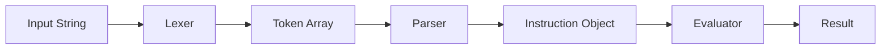

# Expression Language Design

Version: 1.1.0

## Overview
The Spreadsheet ETL Engine implements a **controlled expression language** designed to allow non-technical users to define data transformation rules without executing arbitrary JavaScript code.

This language acts as a **Domain-Specific Language (DSL)** focused on:
- Data referencing
- Safe logical filtering
- Controlled formula construction
- Syntax validation
- Predictable evaluation

The primary design goal is **safety and determinism over flexibility**.


## Motivation
Using direct `eval()` in user-provided expressions introduces:
- Security risks
- Arbitrary code execution
- Data corruption
- Unpredictable behavior
- Hard-to-debug errors

Instead, this engine defines a **restricted expression grammar** that supports only a safe subset of logical and reference operations.

This approach enables:

- Controlled evaluation
- Clear validation
- Deterministic outcomes
- User-friendly error reporting

## Core Concepts
The expression language is based on **explicit prefixes and delimiters** rather than free-form scripting.

### Prefixes
| Prefix      | Purpose                          |
|-------------|----------------------------------|
| `//`        | Marks comment lines in Map sheet |
| `_filter:`  | Marks a filter rule              |
| `eval:`     | Indicates logical evaluation     |
| `constant:` | Defines static output values     |
| `formula:`  | Indicates spreadsheet formulas   |
| `src`       | References source columns        |
| `self`      | References generated columns     |

## Delimiters
The engine uses explicit delimiters to define tokens:
```
src[ColumnName]
self[ColumnName]
```

This design avoids ambiguity and allows deterministic parsing.


## Formal Grammar Definition (BNF)
The Spreadsheet ETL Engine defines a **restricted domain-specific language (DSL)** for logical filtering and column referencing.
The grammar is intentionally minimal to ensure deterministic parsing and safe evaluation.

The following specification is written using **Backus–Naur Form (BNF)**.

### 1. Lexical Foundations
Before defining expressions, we define the primitive symbols used by the language.
```
<letter> ::= "A" | "B" | ... | "Z"
           | "a" | "b" | ... | "z"
<digit>  ::= "0" | "1" | ... | "9"
<alphanumeric> ::= <letter> | <digit> | "_"
```
### 2. Identifiers
Column names and symbolic identifiers are defined as:
```
<identifier> ::= <letter> { <alphanumeric> }*
```

Examples:
* `Name`
* `total_amount`
* `Column1`

### 3. Literals
#### Numeric Literals
```
<number> ::= <digit> { <digit> }*
           | <digit> { <digit> }* "." <digit> { <digit> }*
```

#### String Literals
```
<string> ::= "\"" { <letter> | <digit> | " " | "_" }* "\""
```

### 4. Delimited References
The engine uses explicit delimiters instead of parentheses.

#### Source Reference
```
<src-ref> ::= "src" "[" <identifier> "]"
```

#### Self Reference
```
<self-ref> ::= "self" "[" <identifier> "]"
```

### 5. Operands
An operand represents a value used in logical evaluation.
```
<operand> ::= <src-ref>
            | <self-ref>
            | <number>
            | <string>
            | <identifier>
            | <formula-operand>
```

#### Formula Operand
A formula can be used as an operand in conditions. It must start with `=`.
```
<formula-operand> ::= "=" <formula-body>
```

### 6. Operators
```
<operator> ::= "=="
             | "!="
             | ">"
             | "<"
             | ">="
             | "<="
```

### 7. Logical Connectors
Only logical OR is supported.
```
<logical-or> ::= "||"
```

### 8. Conditions
A condition compares two operands.
```
<condition> ::= <operand> <operator> <operand>
```

### 9. Expression
An expression is a sequence of one or more conditions joined by logical OR.
```
<expression> ::= <condition>
               | <condition> <logical-or> <expression>
```

Equivalent compact form:

```
<expression> ::= <condition> { "||" <condition> }*
```

### 10. Filter Rule
```
<filter-rule> ::= "_filter:" "eval:" <expression>
                | "_filter:" "eval:" "formula:" "=" <formula-body>
```

The formula variant allows spreadsheet formulas to be used as filter conditions. The formula must return TRUE or FALSE.

### 11. Constant Rule
```
<constant-rule> ::= "constant:" <string>
                  | "constant:" <number>
```

### 12. Formula Rule
```
<formula-rule> ::= "formula:" "=" <formula-body>
```

The formula must start with `=` after the `formula:` prefix.

### 13. Direct Rule
A direct reference to a source column without any prefix.
```
<direct-rule> ::= <identifier>
```

The identifier must match a column name from the source sheet.

## Structural Constraints
The grammar intentionally **does not allow**:
```
<and-operator> ::= NOT DEFINED
<parenthesis>  ::= NOT DEFINED
<function-call>::= NOT DEFINED
<nesting>      ::= NOT DEFINED
```

These exclusions are deliberate to preserve:

* Linear parsing
* Deterministic evaluation
* Non-technical usability
* Security guarantees

## Parsing Characteristics
| Property          | Value                             |
|-------------------|-----------------------------------|
| Grammar Type      | Context-Free                      |
| Parsing Direction | Left-to-Right                     |
| Ambiguity         | None (by design)                  |
| Recursion         | Right recursion in `<expression>` |
| Evaluation Safety | High                              |
| Complexity        | O(n)                              |


## Design Rationale
The DSL sacrifices expressive power in favor of:
* Predictability
* Error transparency
* Syntax validation simplicity
* Safe execution
* Maintainability

This grammar demonstrates foundational principles from:
* Formal language theory
* Lexical analysis
* Syntax definition
* Deterministic parsing
* Controlled evaluation systems

## Implementation Architecture

The engine implements a **three-phase interpreter** pattern:



### Phase 1: Lexer (Tokenization)

The `Lexer` module converts raw input strings into a structured array of tokens. Each token has:
- `type`: The token category (e.g., `SRC_REF`, `OPERATOR`)
- `value`: The extracted value
- `raw`: The original text representation

```javascript
// Input: 'src[Name] == "John" || src[Age] > 25'
// Output:
[
  { type: 'SRC_REF', value: 'Name', raw: 'src[Name]' },
  { type: 'OPERATOR', value: '==', raw: '==' },
  { type: 'STRING', value: 'John', raw: '"John"' },
  { type: 'OR', value: '||', raw: '||' },
  { type: 'SRC_REF', value: 'Age', raw: 'src[Age]' },
  { type: 'OPERATOR', value: '>', raw: '>' },
  { type: 'NUMBER', value: 25, raw: '25' }
]
```

#### Token Types

| Type       | Pattern     | Example                          |
|------------|-------------|----------------------------------|
| `SRC_REF`  | `src[...]`  | `src[ColumnName]`                |
| `SELF_REF` | `self[...]` | `self[OutputCol]`                |
| `FORMULA`  | `=...`      | `=SUM(A1:B1)`                    |
| `STRING`   | `"..."`     | `"hello"`                        |
| `NUMBER`   | digits      | `42`, `3.14`                     |
| `OPERATOR` | comparison  | `==`, `!=`, `>`, `<`, `>=`, `<=` |
| `OR`       | `\|\|`      | `\|\|`                           |
| `TEXT`     | literal     | any untokenized text             |

### Phase 2: Parser (Syntactic Analysis)

The `Parser` module transforms token arrays into structured instruction objects. It handles:

1. **Instruction Classification**: Determines if the instruction is a `DIRECT`, `CONSTANT`, `FORMULA`, or `FILTER` type.

2. **Condition Parsing**: Splits expressions by `||` and extracts left operand, operator, and right operand for each condition.

3. **Validation**: Ensures delimiters are balanced and source references exist.

```javascript
// Parsed Filter Example
{
  type: 'FILTER',
  header: '_filter:IsActive',
  isEval: true,
  isFormula: false,
  conditions: [
    { left: { type: 'SRC_REF', column: 'Status' }, op: '==', right: { type: 'STRING', value: 'Active' } },
    { left: { type: 'SRC_REF', column: 'Amount' }, op: '>', right: { type: 'NUMBER', value: 100 } }
  ]
}
```

### Phase 3: Evaluator (Execution)

The `Evaluator` module executes parsed instructions against runtime data:

1. **Operand Resolution**: Converts `SRC_REF` to source data values, `SELF_REF` to output values.

2. **Operator Application**: Applies comparison operators without JavaScript `eval()`.

3. **Formula Evaluation**: Uses a sandbox sheet for spreadsheet formula execution.

```javascript
// Evaluation Context
const context = {
  sourceData: { Name: 'John', Age: '30', Status: 'Active' },
  outputData: { FullName: 'John Doe' },
  header: '_filter:IsActive',
  isFormula: false
};
```

### Module Separation Benefits

| Aspect              | Benefit                                         |
|---------------------|-------------------------------------------------|
| **Testability**     | Each module can be unit tested independently    |
| **Extensibility**   | New token types or operators added in one place |
| **Readability**     | Clear separation of concerns                    |
| **Debugging**       | Token stream can be inspected at each phase     |
| **Maintainability** | Changes to one phase don't affect others        |

## Token Referencing

### Source Reference
```
src[ColumnName]
```
Resolves to the value of a column from the input sheet.

### Self Reference
```
self[ColumnName]
```
Resolves to the generated column reference within the same output row.
This allows column chaining without circular dependencies.

## Comment Lines
Lines starting with `//` in the Map sheet are ignored during parsing:
```
// This is a comment and will be skipped
Name    src[FullName]
```

## Formula Evaluation Sandbox
Formulas are evaluated in a hidden sandbox sheet (`_EVAL_SANDBOX_`) to avoid interference with user data. This ensures safe and isolated formula execution.

## Automatic Value Formatting
When values are used within formulas, they are automatically formatted:

| Input Value  | Formatted As       |
|--------------|--------------------|
| Empty/null   | `""`               |
| `DD/MM/YYYY` | `DATE(YYYY;MM;DD)` |
| `DD-MM-YYYY` | `DATE(YYYY;MM;DD)` |
| Text         | `"text"` (quoted)  |
| Number       | Unchanged          |

## Delimiter Validation
Before parsing, each instruction is validated for balanced delimiters.

### Purpose
- Prevent malformed expressions
- Avoid parser corruption
- Provide early error detection
- Maintain structural integrity

### Method
A linear scan counts opening and closing symbols:
- Increment on `[`
- Decrement on `]`
- Error if counter becomes negative
- Error if final counter ≠ 0

Time complexity: **O(n)**

## Regular Expression Design
The `Lexer` uses pattern matching with regular expressions to identify tokens.

### Pattern Precedence
Patterns are checked in order of specificity:
1. `SRC_REF` and `SELF_REF` (most specific)
2. `FORMULA` (starts with `=`)
3. `STRING` (quoted)
4. `NUMBER` (numeric)
5. `OPERATOR` (comparison symbols)
6. `OR` (logical connector)
7. `TEXT` (fallback for unmatched content)

### Example Pattern
```javascript
// Lexer pattern definition
{ type: 'SRC_REF', regex: /src\[([^\]]+)\]/g }
```

### Design Principles
* **Ordered matching**: More specific patterns checked first
* **Capturing groups**: Extract inner values (e.g., column name)
* **Global flag**: Support multiple matches
* **Fallback handling**: Unmatched text becomes `TEXT` token

## Safe Evaluation Logic
The `Evaluator` module executes logical expressions without JavaScript `eval()`.

### Supported Operators
```
==  !=  >  <  >=  <=
||
```

### Evaluation Strategy
1. **Resolve operands**: Convert `SRC_REF` and `SELF_REF` to actual values
2. **Apply operator**: Use predefined operator functions
3. **Handle OR logic**: Return `true` if any condition passes
4. **Formula fallback**: Use sandbox sheet for spreadsheet formulas

### Operator Functions
```javascript
operators: {
  '==': (a, b) => a == b,
  '!=': (a, b) => a != b,
  '>':  (a, b) => parseFloat(a) > parseFloat(b),
  '<':  (a, b) => parseFloat(a) < parseFloat(b),
  '>=': (a, b) => parseFloat(a) >= parseFloat(b),
  '<=': (a, b) => parseFloat(a) <= parseFloat(b),
}
```

No dynamic code execution occurs.

## Type Handling
* Numeric comparisons use `parseFloat`.
* String comparisons use equality operators.
* Formula outputs preserve spreadsheet syntax.
* Percentage values are normalized before numeric comparison.

## Error Handling Philosophy
Errors should be:
* Detected early
* Explicitly thrown
* Contextualized with rule headers
* Designed for non-technical readability

The engine prioritizes **clarity over silent failure**.

## Trade-offs
| Feature           | Status        | Reason             |
|-------------------|---------------|--------------------|
| Nested logic      | Not supported | Complexity control |
| AND operator      | Not supported | Prevent ambiguity  |
| Functions         | Not supported | Safety             |
| Arbitrary JS      | Forbidden     | Security           |
| Parenthesis logic | Not supported | DSL simplicity     |

These limitations are intentional and align with the engine’s goals.

## Design Goals Recap
* Deterministic behavior
* Syntax safety
* Controlled expressiveness
* Non-technical usability
* Parsing transparency
* Maintainable evaluation model

## Future Expansion Possibilities
* Logical AND support
* Grouped expressions with parentheses
* Custom operators
* Typed expressions
* Arithmetic operations in conditions

Any expansion must preserve the safety guarantees of the current model.